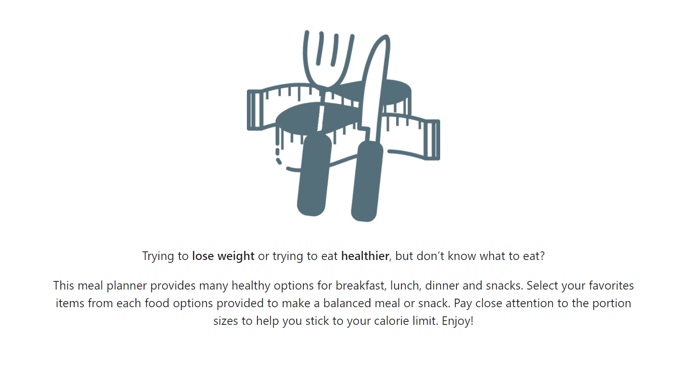

# Healthy Meal Planner - Testing Protocol

[Demo of Website](https://healthy-meal-planner.herokuapp.com/).

Refer to [Main project file](README.md) for further detail.

## Code validation

- [W3C CSS Jigsaw Validator](https://jigsaw.w3.org/css-validator/)
- [W3C Markup Validator](https://validator.w3.org/#validate_by_input)
- [JSHint Validator](https://jshint.com/)

<!--All HTML, CSS and JS files were validated with direct input and returned no errors at the time of this entry.-->

## User stories testing

1.	As a new visitor to the website, I want to understand the main concept of the plan.

    - As a new visitor, I understand the objective of the application with the welcoming Home page text.

2.	As a new visitor to the website, I want to find instructions on how to use the application.

    - 

3.	As a new visitor to the website, I want to register with the application.

    - As a new visitor, I can navigate to Log In / Register page from the navigation bar and create a new account.

4.	As a user, I want to create meal options following the recommendation.

    - As a user, I can navigate to the Build Meal page and add a new personalized meal that are aligned with the guidelines. 

5.	As a user, I want to create a meal plan for the week.

    - 

6.	As a user, I want to be able to create, update or delete the meal options and plan.

    - 

7.	As the application administrator, I want to be able to update the servings portions.

    - As the administrator, I can view available serving options by navigating to "Manage Servings".
    - As the administrator, I can add new serving options by clicking the plus button, filling and submiting a form.
    - As the administrator, I can update existing servings by clicking the update (pen symbol) button, filling and submiting a form.
    - As the administrator, I can delete existing servings by clicking the delete (minus symbol) button.

## Manual testing of features

The deployed Heroku website was viewed on <!--2 desktops screens (21 and 13 inches) and also on Motorola G6 Play device.-->

The website was tested with <!--Google Chrome (v.##), Mozilla Firefox (v.##) and Microsoft Edge (v.##) browsers.-->

On mobile, it was viewed <!--with Google Chrome application v.## on Android #.-->

The Developer Tools of Google Chrome (v.##) on desktop was used to verify responsiveness on different devices.

1. **Home Page**:

   | Test No. | Action & expected results                                    | Pass / Fail |
   | -------- | :----------------------------------------------------------- | :---------- |
   | 1.1      | Enter https://healthy-meal-planner.herokuapp.com/ as the URL and verify the Home Page is displayed. | Pass        |

2. **Register / Log Out:**

   | Test No. | Action & expected results                                    | Pass / Fail |
   | -------- | :----------------------------------------------------------- | :---------- |
   | 2.1      | From the Navigation Bar, click on Log In / Register. Verify the Log In / Register page is loaded. | Pass        |
   | 2.2      | On the register side, enter a new user name and a password following the helper text and click Submit. Verify the Profile page for the created user is loaded. | Fail*       |
   | 2.3      | Click on the Log Out button on the Navigation Bar and verify the session is deleted and user is redirected to Home page. | Pass        |
   | 2.4      | Navigate to Log In / Register page and attempt to create the same user created on step 2.2. Verify a flash message is displayed indicating that the username already exists and registration does not complete. | Pass        |

   *As there was no meals prepared for the new user, there was the following error: "local variable 'servings_selected' referenced before assignment". Error was fixed with by declaring the servings_selected on the scope of route function.

3. **Log In:**

   | Test No. | Action & expected results                                    | Pass / Fail |
   | -------- | :----------------------------------------------------------- | :---------- |
   | 3.1      | Navigate to Log In / Register page and attempt to Log In using a random username and password. Verify a flash message is displayed indicating invalid username and / or password and log in does not complete. | Pass        |
   | 3.2      | Navigate to Log In / Register page and attempt to Log In using the username created in step 2.2 with an incorrect password. Verify a flash message is displayed indicating invalid username and / or password and log in does not complete. | Pass        |
   | 3.3      | Navigate to Log In / Register page and attempt to Log In using the username created in step 2.2 with the correct password. Verify the Profile page for the user is loaded. | Pass        |

4. **Manage Servings:**

   For this testing, an Administrator account is needed. An account is "Administrator" by setting the property "Admin" on the user document to True on the Users Collection manually.

   | Test No. | Action & expected results                                    | Pass / Fail |
   | -------- | :----------------------------------------------------------- | :---------- |
   | 4.1      | Navigate to Log In / Register and login using an Administrator account. From the navigation bar, click in Manage Servings and verify the Servings page loads displaying the available portions from the serving_options collection. | Pass        |
   | 4.2      | Scroll until the last Serving displayed and click the add "plus" button. Verify the form for adding a new Serving is loaded. | Pass        |
   | 4.3      | Click on the cancel "times" button and verify the Servings page is displayed once more without any changes to the serving. | Fail*       |
   | 4.4      | Scroll until the last Serving displayed and click the add "plus" button. Select each radio button for the category and verify the options for the type adjust to the selected category. | Pass        |
   | 4.5      | Include the following inputs for the adding a new Meal: Lunch> Protein> Turkey > 1> ounce Verify the card is added to the Servings page with newly created option. | Pass        |
   | 4.6      | Click on the edit "pen" button of the newly created card and verify the Edit Serving page is loaded with the content of the  serving pre-populated. | Fail**      |
   | 4.7      | Change one of the fields and click on update. Verify on the Servings page the document is correctly updated. | Pass        |
   | 4.8      | Click on the delete "minus" button of the newly created card. Verify a confirmation prompt is displayed. Click Cancel and verify the serving was not deleted. | Pass        |
   | 4.9      | Click on the  delete "minus" button of the newly created card. Verify a confirmation prompt is displayed. Click Ok and verify the serving is deleted. | Pass        |

   *when the templates were developed, the cancel functionality was missed in error. The button was then add to the top of both edit and add forms and is not functional.

   **the servings route was popping out the ID in error. The line of code was removed from the servings routing and the edit page could identify the correct document.

5. **Manage Meals:**

   For this testing, a User account is needed. For this test, it is interesting to have the Servings options database populated to check for all meal options.

   | Test No. | Action & expected results                                    | Pass / Fail |
   | -------- | :----------------------------------------------------------- | :---------- |
   | 5.1      | Navigate to Log In / Register and login using the credentials created in step 2.2. From the navigation bar, click in Build Meal and verify the Build Meal page loads. | Pass        |
   | 5.2      | Click on the cancel "times" button and verify the Meal page is displayed once more without any changes. | Pass        |
   | 5.3      | Scroll until the last Meal (if any) displayed and click the add "plus" button. Verify the verify the Build Meal page loads. | Pass        |
   | 5.4      | Add a meal name and select each the Category Breakfast. Verify the Serving Selections are displayed.  Click on each option and verify on the dropdown the correct amount of portions for the meal is available for selection. | Pass        |
   | 5.5      | Select each of the other Categories available and verify the dropdowns update accordingly. | Pass        |
   | 5.6      | Populate each form field and click the Add button. Verify the Profile page is reloaded and the created meal is displayed correctly. | Fail*       |
   | 5.7      | Click on the edit "pen" button of the newly created card and verify the Edit Meal page is loaded with the content of the meal pre-populated. | Fail**      |
   | 5.8      | Change one of the fields and click on update. Verify on the Profile page the document is correctly updated. | Pass        |
   | 5.9      | Click on the delete "minus" button of the newly created card. Verify a confirmation prompt is displayed. Click Cancel and verify the Meal was not deleted. | Pass        |
   | 5.10     | Click on the  delete "minus" button of the newly created card. Verify a confirmation prompt is displayed. Click Ok and verify the Meal is deleted. | Pass        |

   *the building of servings of the profile page was not being update for each built meal and all meals where showing the same portions. To correct this, the servings_selected on the profile route was update to a dictionary using each built_meal name as key.

   **as duplicated selected servings were condensed to unique values when adding the meal, they were not showing correctly on the Edit Meal page. To correct this, the duplicated servings are extended on python to match the amount of options correctly.

6. 

   ### Known issues

   If a serving that is referenced by one or more of the built meals is deleted from the database, there will be an error loading the profile page.
   At the moment, to avoid the error a message is displayed to the user asking them to contact the administrator.
   It would be interesting to either have an automated warning to administrator or a defensive code to prevent the deletion if the serving is referenced.